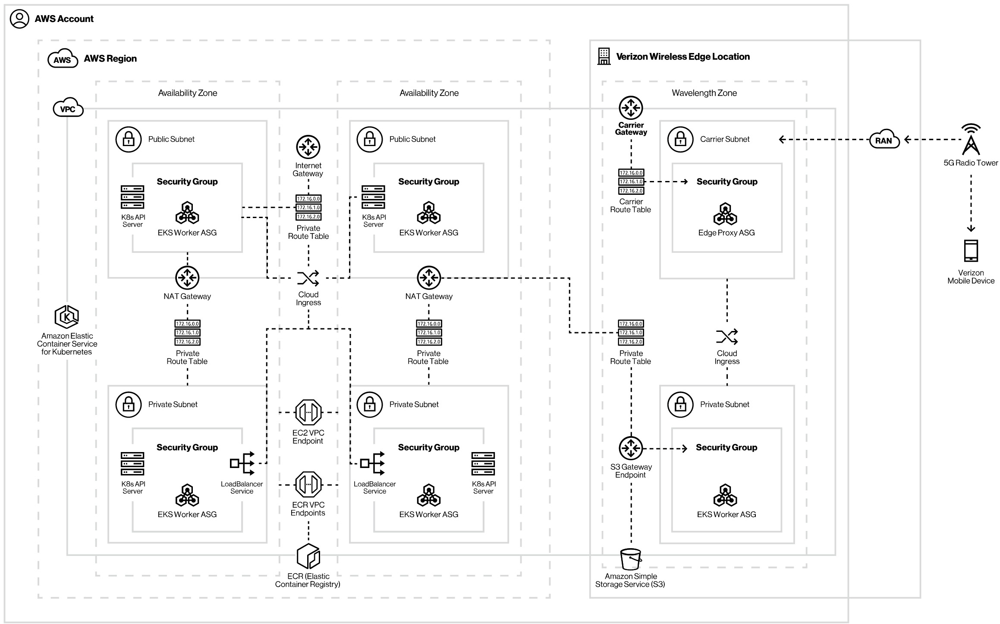

[](https://opensource.newrelic.com/oss-category/#new-relic-experimental)

# vz-newrelic-5g-edge

>A Terraform configuration for deploying a multi-AZ EKS cluster within Verizon’s 5G zones in AWS Wavelength. We are also experimenting with deploying both New Relic and Pixie using Terraform as part of this repo.

## Installation

1. Clone the [vz-newrelic-5g-edge](https://github.com/newrelic-experimental/vz-newrelic-5g-edge.git) repository.

```
git clone https://github.com/newrelic-experimental/vz-newrelic-5g-edge
cd vz-newrelic-5g-edge/wavelength-cluster
```

2. Next, initialize Terraform within your working directory.

```
terraform init
```

3. Edit `terraform.tfvars.example` with any specific configuration details, such as your EKS cluster name, and specific Wavelength Zone(s) of interest.

```
mv terraform.tfvars.example terraform.tfvars
```

4. Apply the configuration:

```
terraform plan
terraform apply
```

## Deploy Pixie and New Relic

We've intentionally kept this install as a separate step due to issues with cleaning destroying the cluster outlined in this [github issue](https://github.com/hashicorp/terraform-provider-helm/issues/593).  After the cluster has been successfully deployed, deploy Pixie and New Relic to the cluster using the `pixie_nr_module` in the `pixie-newrelic` directory.

1. Change directory to `pixie-newrelic`
```
cd ../pixie-newrelic
terraform init
```

2. Update config variables for the `pixie_nr_module`.  Some defaults have been set but feel free to override them according to your preferences.  The `nr_license_key`, `pixie_api_key` and `pixie_deploy_key` variables must be set for a successful deployment.  These can be obtained from the New Relic Guided Install for Kubernetes UI.

```
module "pixie" {
  source = "./pixie-nr-module"

  nr_bundle_infra           = true  # installs the New Relic Infrastructure Daemonset
  nr_bundle_prometheus      = false # installs the New Relic Prometheus OpenMetrics Integration
  nr_bundle_webhook         = false # installs the New Relic Metadata Injection Webhook
  nr_bundle_ksm             = true  # installs Kube State Metrics
  nr_bundle_kube_events     = true  # installs the New Relic Kubernetes Events Integration
  nr_bundle_logging         = false # installs the New Relic Logs Integration (Fluent-Bit)
  nr_bundle_pixie           = true  # installs the New Relic / Pixie Integration
  nr_bundle_pixie_chart     = true  # installs the Pixie Operator
  nr_bundle_infra_operator  = false # installs the New Relic Infrastructure Operator (Fargate-only)
  nr_bundle_metrics_adapter = false # installs the New Relic Metrics Adapter
  patch_pixie               = true  # enables the necessary patching so Pixie will run successfuly in a Wavelength cluster

  nr_license_key   = "<NR LICENSE KEY>"
  pixie_api_key    = "<PIXIE_API_KEY>"
  pixie_deploy_key = "<PIXIE_DEPLOY_KEY>"
  cluster_name     = local.cluster_name

  kubernetes_host_info = {
    host                   = data.aws_eks_cluster.cluster.endpoint
    cluster_ca_certificate = base64decode(data.aws_eks_cluster.cluster.certificate_authority[0].data)
    token                  = data.aws_eks_cluster_auth.cluster.token
  }
}
```

3. Deploy the integrations

```
terraform plan
terraform apply
```

## EKS Wavelength Reference Architecture



More at https://www.verizon.com/business/solutions/5g/edge-computing/developer-resources/edge-kubernetes-reference-architecture/

## Support

This code solves an interesting problem, but does not yet have an active maintainer(s). The project is being developed in the open for the purpose of feedback on a new feature or function.

## Contributing
We encourage your contributions to improve `vz-newrelic-5g-edge`. Keep in mind when you submit your pull request, you'll need to sign the CLA via the click-through using CLA-Assistant. You only have to sign the CLA one time per project.
If you have any questions, or to execute our corporate CLA, required if your contribution is on behalf of a company,  please drop us an email at opensource@newrelic.com.

**A note about vulnerabilities**

As noted in our [security policy](../../security/policy), New Relic is committed to the privacy and security of our customers and their data. We believe that providing coordinated disclosure by security researchers and engaging with the security community are important means to achieve our security goals.

If you believe you have found a security vulnerability in this project or any of New Relic's products or websites, we welcome and greatly appreciate you reporting it to New Relic through [HackerOne](https://hackerone.com/newrelic).

## License
`vz-newrelic-5g-edge` is licensed under the [Apache 2.0](http://apache.org/licenses/LICENSE-2.0.txt) License.
